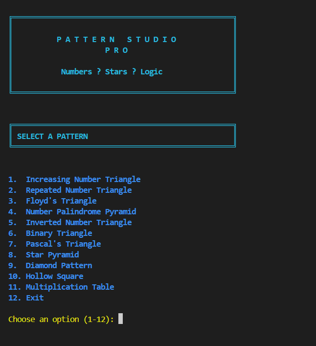
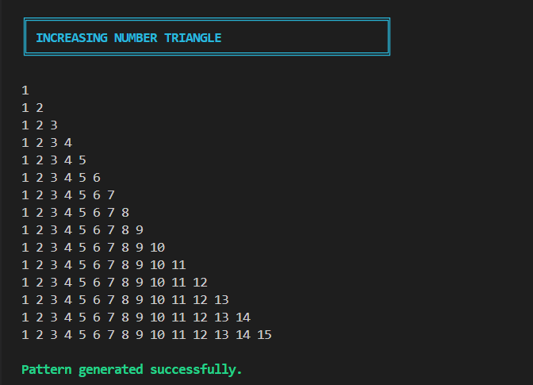
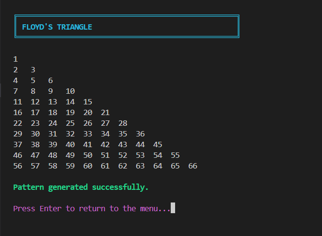
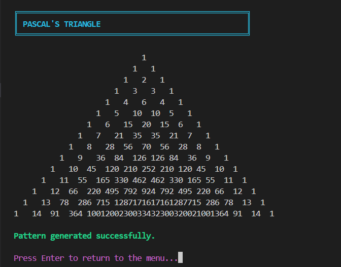
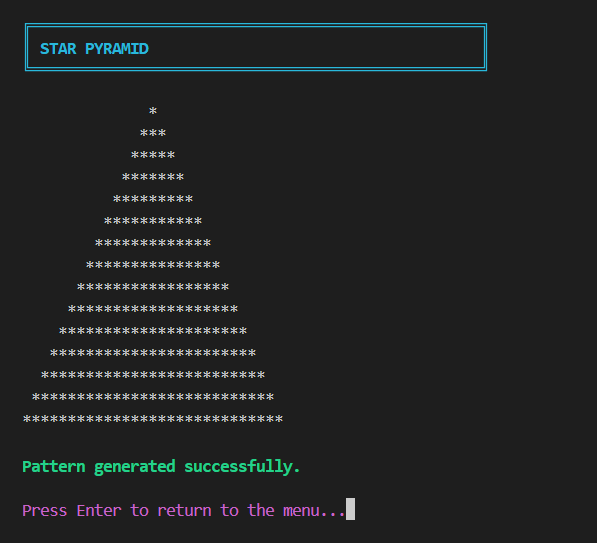
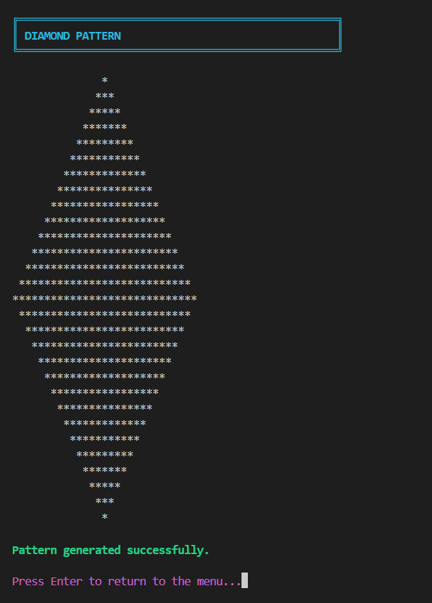
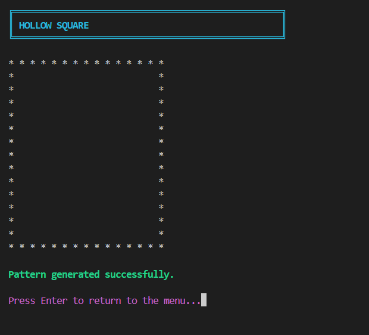
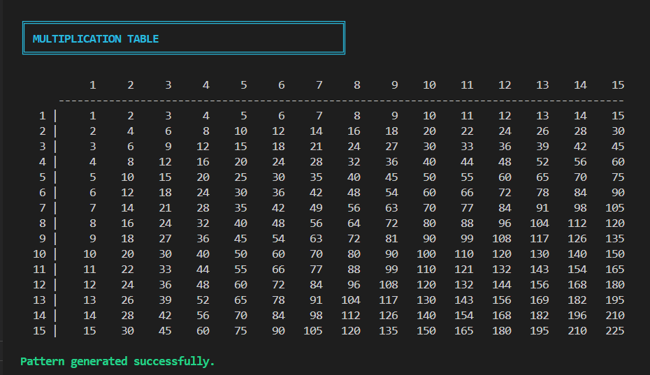
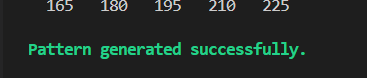
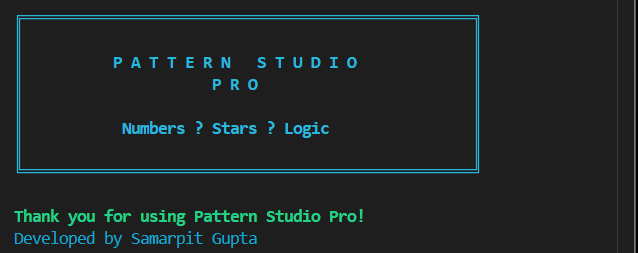

# 🎨 Pattern Studio Pro

<div align="center">


### ✨ Professional Java Pattern Generator
**Developed as part of the Cognifyz Software Development Internship**

</div>

---

# 📌 Project Overview

Pattern Studio Pro is a professional Java console application that generates multiple number and star patterns using loops, nested loops, conditional statements, and Object-Oriented Programming.

The application provides an interactive menu-driven interface where users can choose from a variety of pattern types, specify the desired size, and instantly generate the selected pattern.

The project demonstrates logical thinking, problem-solving, modular programming, and clean code organization while providing a visually enhanced console experience.

---

# 🚀 Features

## 🔢 Number Patterns

- Increasing Number Triangle
- Repeated Number Triangle
- Floyd's Triangle
- Number Palindrome Pyramid
- Inverted Number Triangle
- Binary Triangle
- Pascal's Triangle

---

## ⭐ Star Patterns

- Star Pyramid
- Diamond Pattern
- Hollow Square

---

## 📊 Utility Pattern

- Multiplication Table Generator

---

## 💡 Application Features

- Interactive Menu Driven Interface
- Professional Console UI
- ANSI Colored Output
- User Input Validation
- Error Handling
- Modular Programming
- Clean Project Structure
- Easy Navigation
- Exit Option

---

# 💻 Technologies Used

- Java (JDK 25)
- Object-Oriented Programming (OOP)
- Nested Loops
- Conditional Statements
- Switch Expressions
- Scanner Class
- ANSI Console Colors

---

# 📂 Project Structure

```
Number_Pattern_Generator
│
├── src
│   ├── Main.java
│   ├── PatternGenerator.java
│   └── ConsoleUI.java
│
├── screenshots
│
├── README.md
├── LICENSE
└── .gitignore
```

---

# ⚙️ How to Run

### Compile

```bash
javac *.java
```

### Run

```bash
java Main
```

---

# 📖 Available Patterns

| Option | Pattern |
|--------|---------------------------|
| 1 | Increasing Number Triangle |
| 2 | Repeated Number Triangle |
| 3 | Floyd's Triangle |
| 4 | Number Palindrome Pyramid |
| 5 | Inverted Number Triangle |
| 6 | Binary Triangle |
| 7 | Pascal's Triangle |
| 8 | Star Pyramid |
| 9 | Diamond Pattern |
| 10 | Hollow Square |
| 11 | Multiplication Table |
| 12 | Exit |

---

# 🧠 Programming Concepts Used

- Classes and Objects
- Methods
- Encapsulation
- For Loops
- Nested Loops
- While Loops
- Switch Case
- Conditional Statements
- Scanner
- Input Validation
- Modular Programming
- Console Formatting

---

# 🎯 Learning Outcomes

This project helped in understanding:

- Loop Control
- Nested Loop Logic
- Pattern Generation Algorithms
- Row and Column Manipulation
- Mathematical Pattern Logic
- Object-Oriented Programming
- Modular Code Design
- User Input Validation
- Console UI Design

---

# 📷 Screenshots

## Home Screen


---

## Pattern Menu



---

## Increasing Number Triangle



---

## Floyd's Triangle



---

## Pascal's Triangle



---

## Star Pyramid



---

## Diamond Pattern



---

## Hollow Square



---

## Multiplication Table



---

## Success Message



---

## Exit Screen



---

# 🔮 Future Enhancements

- Custom Pattern Designer
- Save Patterns to File
- Export as PDF
- Export as Image
- GUI Version using JavaFX
- Dark Mode
- Pattern Printing Animation
- User Accounts
- Pattern Search
- Pattern History

---

# 🎓 Internship Task

**Internship Provider**

Cognifyz Technologies

**Domain**

Software Development

**Task**

Generate Number Patterns using Java.

---

# 👨‍💻 Author

**Samarpit Gupta**

B.Tech Computer Science Engineering

Cyber Security Enthusiast

GitHub: https://github.com/itsmesamar07

LinkedIn: *(Add your LinkedIn Profile URL)*

---

# ⭐ Project Highlights

✅ Professional Console Interface

✅ 11 Different Patterns

✅ Input Validation

✅ ANSI Color Support

✅ Object-Oriented Programming

✅ Modular Design

✅ Clean Code Structure

✅ GitHub Ready

✅ Internship Ready

---

## 📜 License

This project is developed for educational purposes as part of the **Cognifyz Software Development Internship Program**.